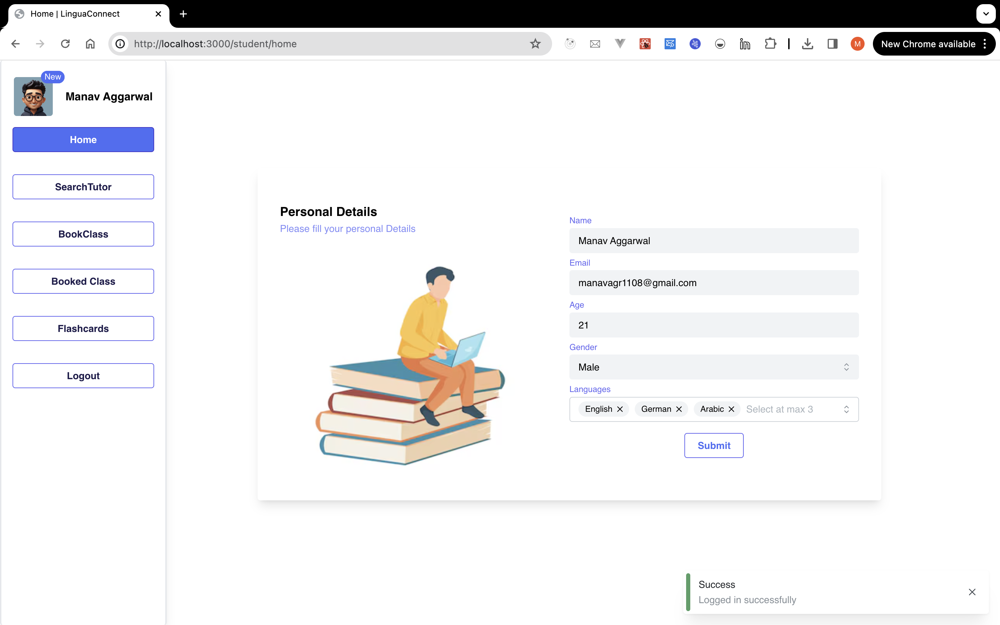

# LinguaConnect

## Overview

Welcome to the LinguaConnect project! This application is designed and developed to create an interactive online platform connecting language learners with teachers for personalized online lessons. The platform allows learners to choose a tutor based on their target language, fluency, budget, and schedule.

## Technologies Used

- ReactJS: A JavaScript library for building user interfaces.
- Tailwind CSS: A utility-first CSS framework for rapidly building custom designs.
- Mantine: A React component library with a focus on usability and developer experience.
- Node.js: A JavaScript runtime for server-side development.
- Express: A fast, unopinionated, minimalist web framework for Node.js.
- MongoDB: A NoSQL database for storing and retrieving data efficiently.

## Features

- User Authentication: Allow users to register, log in, and manage their profiles.
- Tutor Selection: Enable learners to search and select tutors based on language, fluency, budget, and schedule.
- Scheduling System: Implement a scheduling system for learners to book personalized online lessons with their chosen tutors.
- Payment Integration: Integrate a payment system to handle transactions between learners and tutors.
- User Dashboard: Provide a user-friendly dashboard for both learners and tutors to manage their profiles, schedules, and transactions.

## Workflows

## ScreenShots

### Student

### Tutor

